<!-- Generated by GitHub Profile Agent Console. Edit profile.config.json, then run npm run generate. -->

  <picture>
    <source media="(max-width: 760px) and (prefers-color-scheme: dark)" srcset="./assets/hero/agent-console-c1499fb3-mobile-dark.svg">
    <source media="(max-width: 760px)" srcset="./assets/hero/agent-console-c1499fb3-mobile-light.svg">
    <source media="(prefers-color-scheme: dark)" srcset="./assets/hero/agent-console-c1499fb3-dark.svg">
    <source media="(prefers-color-scheme: light)" srcset="./assets/hero/agent-console-c1499fb3-light.svg">
    
  </picture>

  

## About Me

I am a Fullstack Web Developer and Junior Penetration Tester studying at SMKN 2 Probolinggo.

I build secure, responsive web applications while exploring cybersecurity, ethical hacking, and vulnerability assessment.

## Current Focus

| Area | What I am exploring |
| --- | --- |
| **Fullstack Web** | Building responsive frontends and reliable backend API services. |
| **Penetration Testing** | Identifying web vulnerabilities and testing system security posture. |
| **Web Security** | Implementing secure authentication, input sanitization, and code auditing. |

## Featured Work

| Project | Focus | Why it matters |
| --- | --- | --- |
| [**Web Security Lab**](https://github.com/xiu181007/web-security-lab) | Vulnerability Assessment | Tools and scripts for scanning web application security and testing defenses. |
| [**Fullstack Project**](https://github.com/xiu181007/fullstack-project) | Modern Web Development | A fullstack web application built with responsive UI and secure REST APIs. |

## Research Direction

I am passionate about building modern web applications with robust architecture while analyzing system vulnerabilities to ensure secure software deployment.

## Tech Stack

`JavaScript` · `TypeScript` · `Node.js` · `PHP` · `Laravel` · `Python` · `Linux` · `Burp Suite` · `Nmap` · `PostgreSQL` · `Git`

## Recent Activity

<!-- AUTO:ACTIVITY:START -->
_Recent public activity will appear here after the workflow runs._
<!-- AUTO:ACTIVITY:END -->

---

  Building secure fullstack applications and exploring cybersecurity.

